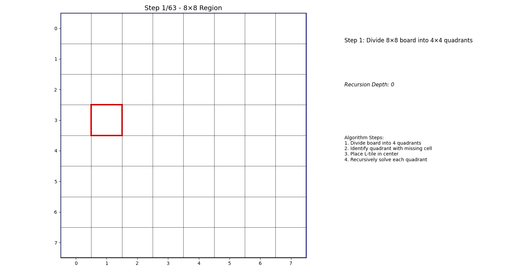

# insertion_sort.c
- You can run insertion sort algorithm step by step explained by running 
```
gcc insertion_sort.c -o insertion_sort
./insertion_sort
```
- then input the size of the randomly generated integer list

## Demo:
[](https://www.youtube.com/watch?v=VIDEO_ID)

# L Shaped Tiling Problem
**Problem:**


**Divide and Conquer Solution Demo:**


**Result:**
